```{r, warning=FALSE, echo = FALSE}


library(flexdashboard)
library(nflreadr)
library(ggplot2)
library(nflfastR)
library(dplyr)
library(tidyverse)
library(ggrepel)
library(gt)
library(ggimage)
library(gtExtras)
library(kableExtra)
library(DT)
setwd("/Users/Adam/Sports Analytics Hobby/NFL Analytics/nfl-2025-dashboard/")
```


Running Backs
================================
<style>
/* Change sidebar background color */
.flex-page .sidebar {
  background-color: #5b9452; 
}

/* Change text color in the sidebar */
.flex-page .sidebar, .flex-page .sidebar h1, .flex-page .sidebar h2, .flex-page .sidebar h3 {
  color: #FFFFFF;
}
</style>
## Sidebar {.sidebar data-width=400}
------------------------------------------------------
<div style="text-align:center;">
**Overview**
</div>

<div style="text-align:center;">
This dashboard is a side project I have been working on to improve my data manipulation, visualization, and prediction capabilities. Please also visit my portfolio website: _________ my NBA Machine Learning website: https://adamtwhite98-data.github.io/NBA-2023-Machine-Learning/ or my NFL WR Archetpye clustering website:  the latter two of hold more of a Data Science and Machine Learning lens.

To navigate, first utilize the buttons on the top of you screen (white text, blue background), then the ones below them for Position specific visualizations.
</div>

<div style="text-align:center;">
**Explosive Play % and EPA/Play**
</div>

<div style="text-align:center;">
The y-axis (vertical) shows a Runningbacks ability to explode for large chunk plays, with the further up the better. The x-axis (horizontal) highlights that same players average Expected Points Added (EPA) per play, with the further right being better. EPA is an advanced statistic in the NFL that measures the impact of a play on a team's scoring potential. It takes into account the context of the play: a 2 yard rush on 4th on 1 is more valuable than a 2 yard rush on 1st and 10.  Min. 50 carries. 
</div>

<div style="text-align:center;">
**Rush Yards Over Expected**
</div>

<div style="text-align:center;">
Rush yards over expected is a multiple variable regression model that takes into account down, yards to the first down, where the team is on the field, the gap of the run, the score differential and whether the Qb lines up in shotgun. This predicts the yards the Rb will gain based off that, then returns whether he rushed over the expected. The further up vertically the Rb is, the better. Min. 50 carries. 
</div>

<div style="text-align:center;">
**Fantasy Volatility**
</div>

<div style="text-align:center;">
This graph highlights each fantasy Rb's volatility. They are arranged in average FPPG (middle bar), then you cann view their highest and lowest games (thin bar - Gibbs!), and the standard deviation higher or lower from their average score. Min. 9 FPPG and 50 carries. 
</div>

<div style="text-align:center;">
**Running Back Updated Stats**
</div>

<div style="text-align:center;">
Running back updated filterable statistics - one stop shop for rushing, receiving, fumbles, and advanced stats.  Min. 50 carries.
</div>


Column  {.tabset .tabset-fade}
-----------------------------------------------------------------------
### Explosive Play % and EPA/play
```{r}
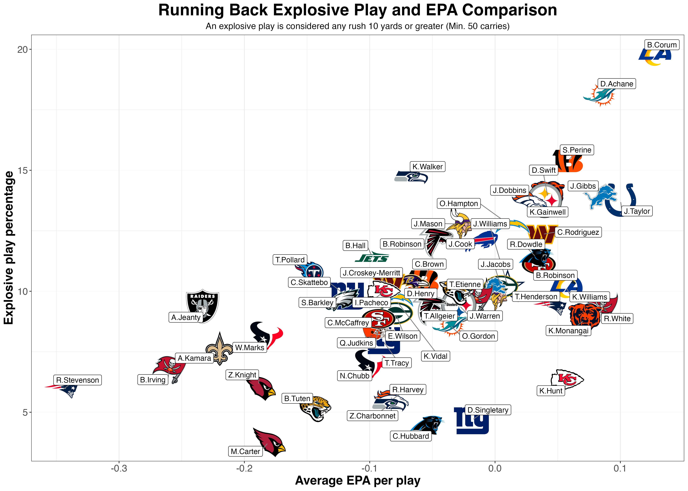
```

### Rush Yards over Expected
```{r}
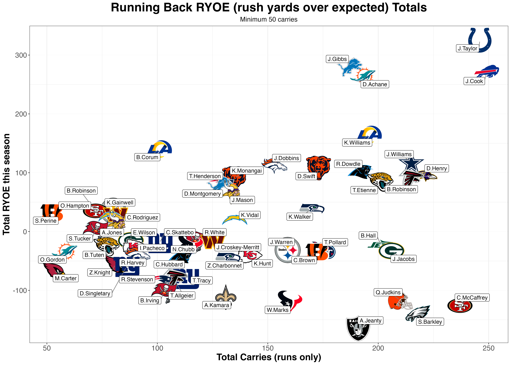
```

### Fantasy Volatility
```{r}
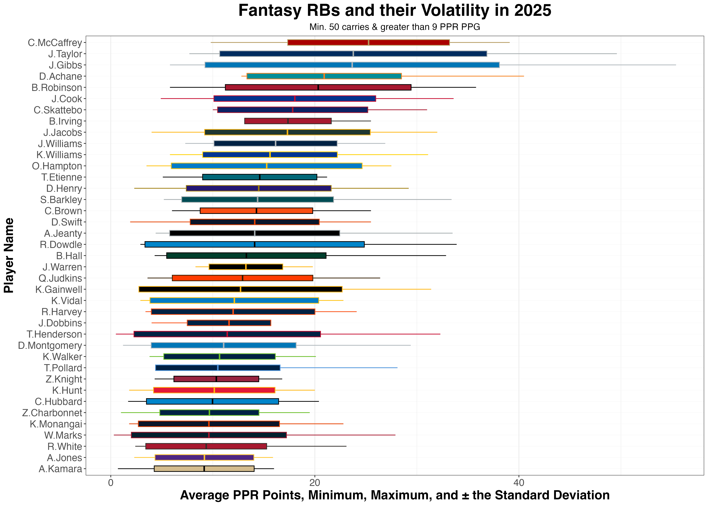
```

### Runninng Back Updated Stats
```{r, echo = FALSE}
season_player_stats <- nflreadr::load_player_stats(
  seasons = 2025,
  summary_level = "reg", 
)

rb_season_stats <- season_player_stats %>%
  filter(position == "RB") %>%
  select(player_id,
         player_name,
         player_display_name,
         carries,
         rushing_yards,
         rushing_tds,
         rushing_fumbles,
         rushing_fumbles_lost,
         rushing_first_downs,
         rushing_epa,
         targets,
         receptions,
         receiving_yards,
         receiving_tds,
         receiving_epa,
         fantasy_points_ppr,
         receiving_first_downs
  ) %>%
  mutate(total_epa = receiving_epa + rushing_epa,
         first_downs = rushing_first_downs + receiving_first_downs) %>%
  filter(carries >= 50) %>%
  arrange(-rushing_yards)

rb_season_stats <- rb_season_stats %>%
  select(player_display_name,
         carries,
         rushing_yards,
         rushing_tds,
         rushing_fumbles,
         rushing_fumbles_lost,
         first_downs,
         rushing_epa,
         targets,
         receptions,
         receiving_yards,
         receiving_tds,
         receiving_epa,
         total_epa,
         fantasy_points_ppr)
colnames(rb_season_stats) <- c("Player", "Carries", "Rushing Yards",
                               "Rushing TD", "Fumbles", "Fumbles Lost",
                               "First Downs", "Rushing EPA", "Targets",
                               "Catches", "Receiving Yards", "Receiving TDs",
                               "Receiving EPA", "Total EPA", "PPR Fantasy PTS")

rb_season_stats <- rb_season_stats %>%
  mutate(across(where(is.numeric), round, digits = 2))

datatable(rb_season_stats, filter = 'top', options = list(pageLength = 25))

```


Receivers (WR, RB, TE)
================================
<style>
/* Change sidebar background color */
.flex-page .sidebar {
  background-color: #5b9452; 
}

/* Change text color in the sidebar */
.flex-page .sidebar, .flex-page .sidebar h1, .flex-page .sidebar h2, .flex-page .sidebar h3 {
  color: #FFFFFF;
}
</style>
## Sidebar {.sidebar data-width=400}
------------------------------------------------------
<div style="text-align:center;">
**Overview**
</div>

<div style="text-align:center;">
This dashboard is a side project I have been working on to improve my data manipulation, visualization, and prediction capabilities. Please also visit my portfolio website: _________ my NBA Machine Learning website: https://adamtwhite98-data.github.io/NBA-2023-Machine-Learning/ or my NFL WR Archetpye clustering website:  the latter two of hold more of a Data Science and Machine Learning lens.

To navigate, first utilize the buttons on the top of you screen (white text, blue background), then the ones below them for Position specific visualizations.
</div>

<div style="text-align:center;">
**Air Yards and Yards After Catch**
</div>

<div style="text-align:center;">
Highlights the top 20 2025 NFL Receiving Yards leaders and their Total Yards, Air Yards, and Yards After Catch (YAC). Brown represents Air Yards (distance ball has traveled in the air from the line of scrimmage) and the green is YAC, yards gained after the receiver catches the ball.
</div>


<div style="text-align:center;">
**Explosive Plays**
</div>

<div style="text-align:center;">
Highlights an NFL WR's ability to make explosive plays. An explosive play is considered any catch where the ball traveled 20 yards or more from the line of scrimmage. The further up a player is, the more explosive plays they have made when targeted. The further right a player is, the more they are targeted - and likely contribute to a teams success. Min. 40 targets.
</div>

<div style="text-align:center;">
**Fantasy Volatility**
</div>

<div style="text-align:center;">
This graph highlights each fantasy WR’s volatility. They are arranged in average FPPG (middle bar), then you can view their highest and lowest games (thin bar), and the standard deviation higher or lower from their average score. Min. 10 FPPG and 30 catches. Imagine if Rashee Rice didn't miss 6! games. 
</div>

<div style="text-align:center;">
**Wide Receiver Updated Stats**
</div>

<div style="text-align:center;">
Wide Receiver updated filterable statistics - one stop shop for receiving, and advanced stats. Air Yards share is the percentage of a teams total Air Yards that player contributed for. Min. 10 targets.
</div>


Column  {.tabset .tabset-fade}
-----------------------------------------------------------------------
### Air Yards vs. Yards After Catch (YAC)
```{r}
knitr::include_graphics("AIR_YAC_yards_25.png")
```

### Explosive Plays
```{r}
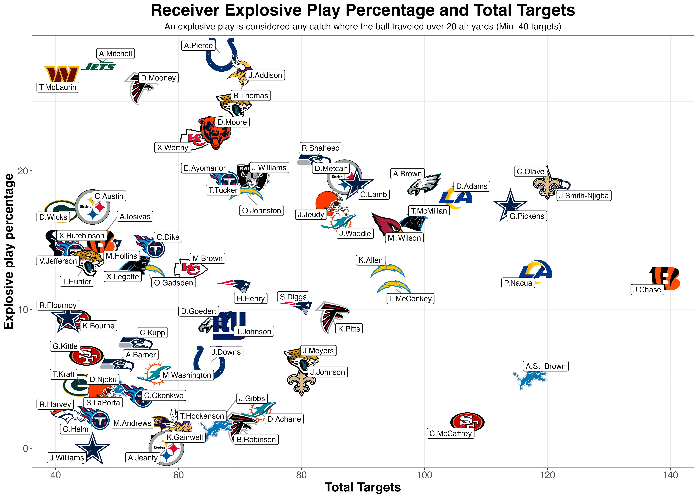
```

### Fantasy Variability
```{r}
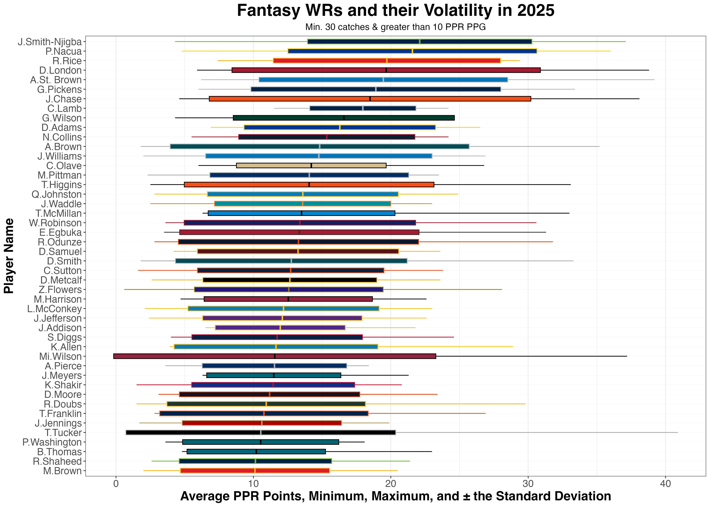
```

### Receiver Updated Stats
```{r}
season_player_stats <- nflreadr::load_player_stats(
  seasons = 2025,
  summary_level = "reg", 
)

wr_season_stats <- season_player_stats %>%
  filter(position == "WR" | position == "TE" | position == "RB") %>%
  select(player_id,
         player_name,
         player_display_name,
         games,
         receptions,
         targets,
         target_share, 
         receiving_yards,
         receiving_tds,
         receiving_yards_after_catch,
         receiving_air_yards,
         receiving_first_downs,
         receiving_epa,
         target_share,
         wopr,
         racr,
         air_yards_share,
         fantasy_points_ppr) %>%
  mutate(target_share = round(100* target_share,2),
         air_yards_share = round(100 * air_yards_share,2)) %>%
  filter(targets >= 10) %>%
  arrange(-receiving_yards)

wr_season_stats <- wr_season_stats %>%
  select(player_display_name,
         games,
         receptions,
         targets,
         target_share,
         receiving_yards,
         receiving_tds,
         receiving_air_yards,
         receiving_yards_after_catch,
         receiving_first_downs,
         receiving_epa,
         air_yards_share,
         fantasy_points_ppr
         ) %>% 
  mutate(receiving_epa = round(receiving_epa,2),
    ypg = round(receiving_yards/games),2)

wr_season_stats <- wr_season_stats %>%
  select(player_display_name,
         games,
         receptions,
         targets,
         target_share,
         receiving_yards,
         ypg,
         receiving_tds,
         receiving_air_yards,
         receiving_yards_after_catch,
         receiving_first_downs,
         receiving_epa,
         air_yards_share,
         fantasy_points_ppr
         )
colnames(wr_season_stats) <- c("Player Name", "Games", "Catches", "Targets",
                              "Target Share", "Receiving Yards", "YPG", "TDs",
                              "Air Yards", "YAC", "First Downs", "Total EPA",
                              "Air Yards Share", "Total Fantasy Points (PPR)")


datatable(wr_season_stats, filter = 'top', options = list(pageLength = 25))
```


Quarterbacks
===============================
<style>
/* Change sidebar background color */
.flex-page .sidebar {
  background-color: #5b9452; 
}

/* Change text color in the sidebar */
.flex-page .sidebar, .flex-page .sidebar h1, .flex-page .sidebar h2, .flex-page .sidebar h3 {
  color: #FFFFFF;
}
</style>
## Sidebar {.sidebar data-width=400}
------------------------------------------------------
<div style="text-align:center;">
Data from Pro Football Reference (PFR), ESPN, and nflreadR - which is the only data used for the other position/Team visuals.
</div>

<div style="text-align:center;">
**Qb Rating and On Target Throw %**
</div>

<div style="text-align:center;">

</div>

<div style="text-align:center;">
**Bad Throw % and Pressure Rate**
</div>

<div style="text-align:center;">

</div>

<div style="text-align:center;">
**Completion % versus League Average**
</div>

<div style="text-align:center;">

</div>

<div style="text-align:center;">
**On Target Throws vs. Drop Percentage**
</div>

<div style="text-align:center;">

</div>

Column {.tabset .tabset-fade}
-----------------------------------------------------------------------
### QB Rating and On Target Throw %
```{r}
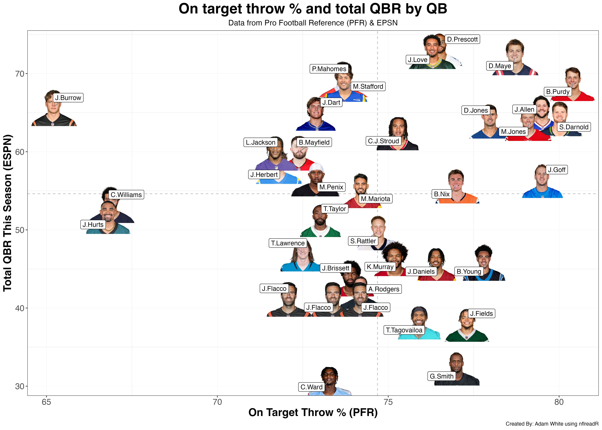
```

### Bad Throw % and Pressure Rate
```{r}
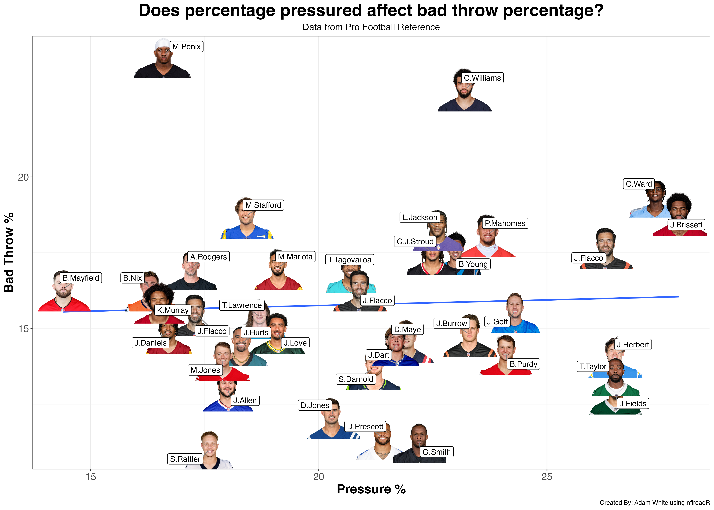
```

### Completion % vs. League Average
```{r}
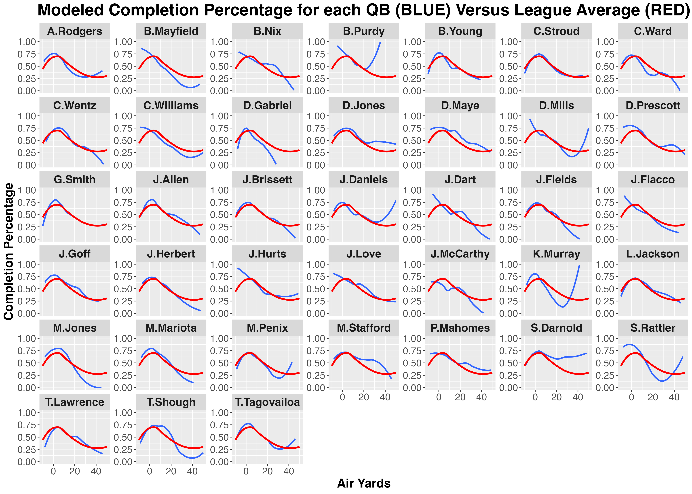
```

### On Target Throws vs. Drop Percentage
```{r}
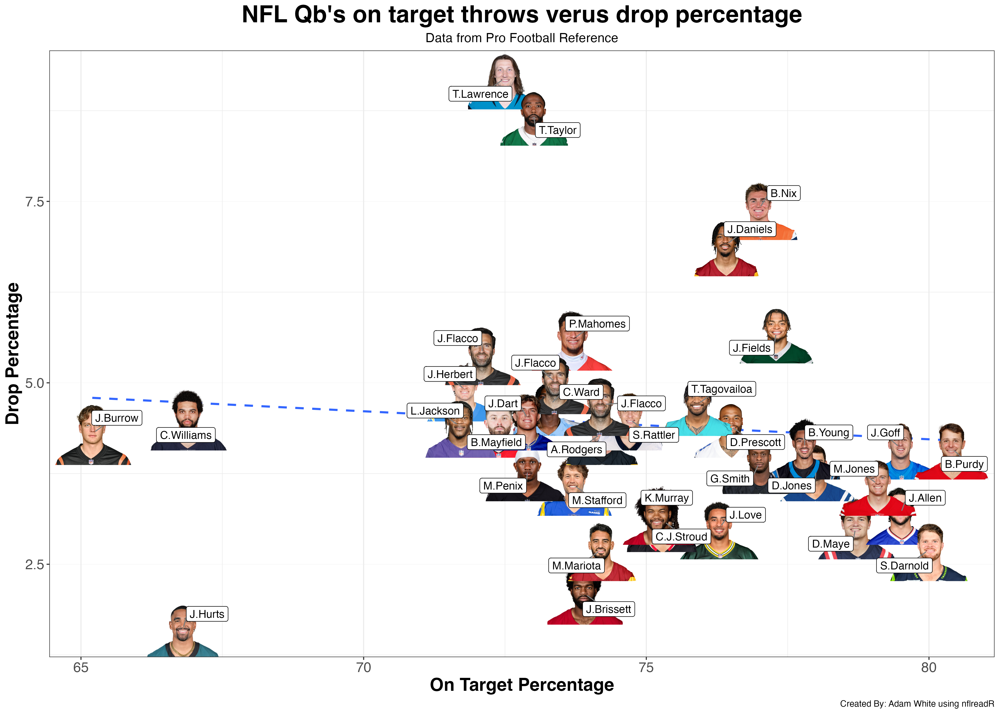
```

Teams
==============================
<style>
/* Change sidebar background color */
.flex-page .sidebar {
  background-color: #5b9452; 
}

/* Change text color in the sidebar */
.flex-page .sidebar, .flex-page .sidebar h1, .flex-page .sidebar h2, .flex-page .sidebar h3 {
  color: #FFFFFF;
}
</style>
## Sidebar {.sidebar data-width=400}
------------------------------------------------------
<div style="text-align:center;">
**Overview**
</div>

<div style="text-align:center;">
This dashboard is a side project I have been working on to improve my data manipulation, visualization, and prediction capabilities. Please also visit my portfolio website: _________ my NBA Machine Learning website: https://adamtwhite98-data.github.io/NBA-2023-Machine-Learning/ or my NFL WR Archetpye clustering website:  the latter two of hold more of a Data Science and Machine Learning lens.

To navigate, first utilize the buttons on the top of you screen (white text, blue background), then the ones below them for Position specific visualizations.
</div>

<div style="text-align:center;">
**Offensive and Defensive EPA/Play**
</div>

<div style="text-align:center;">
Expected Point Added (Definition under Running Backs -> Explosive Play %) for every team for both Offense (Horizontal) and Defense (Vertical). Offense gets better as you move right, Defense as you go up. The elite teams are the handful in the top right corner, and the team(s) likely competing for first overall pick are in the bottom left. 
</div>

<div style="text-align:center;">
**Offensive and Defensive YPP**
</div>

<div style="text-align:center;">
Similar to the previous graph, but shows a Team's Yard Per Play averages on both Offense and Defense. Once again, Offense gets better as you move right, Defense as you go up. The elite teams are the handful in the top right corner, and the team(s) likely competing for first overall pick are in the bottom left. 
</div>

<div style="text-align:center;">
**Updated Strength of Schedule and Team Stats Table**
</div>

<div style="text-align:center;">
Team wide updated filterable statistics - One stop shop for a teams wins, strength of schedule (SOS), game averages for and against (against being how well the other team does) and advanced stats. The table is filterable but is **ordered by Draft Pick** (Playoffs not included). 
</div>

Column {.tabset .tabset-fade}
-----------------------------------------------------------------------
### Offensive and Defensive EPA Per Play
```{r}
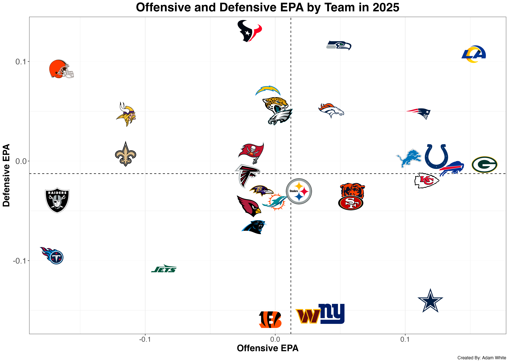
```

### Offensive and Defensive Yards Per Play
```{r}
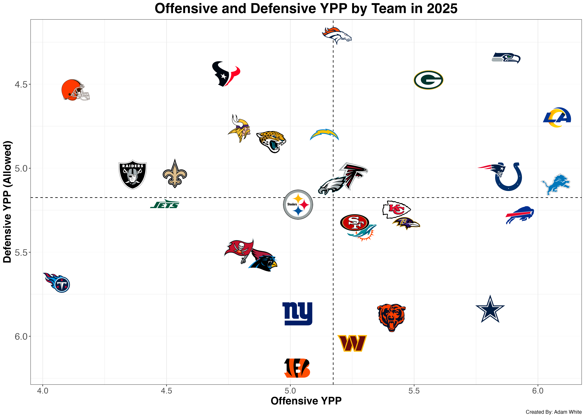
```

### Updated Strength of Schedule and Team Stats Table
```{r}
# Load libraries
library(nflfastR)
library(dplyr)
library(tidyr)
library(stringr)

pbp <- load_pbp(2025)  # or use multiple seasons: load_pbp(2022:2024)


# Offensive metrics
offense_summary <- pbp %>%
  filter(!is.na(posteam)) %>%
  group_by(season, posteam, game_id) %>%
  summarise(
    points = max(posteam_score_post, na.rm = TRUE) - min(posteam_score, na.rm = TRUE),
    yards = sum(yards_gained, na.rm = TRUE),
    plays = n(),
    epa = mean(epa, na.rm = TRUE),
    turnovers = sum(interception == 1 | fumble_lost == 1, na.rm = TRUE),
    .groups = "drop"
  ) %>%
  group_by(season, posteam) %>%
  summarise(
    games_played = n(),
    total_points = sum(points),
    total_yards = sum(yards),
    total_turnovers = sum(turnovers),
    epa_per_play_off = mean(epa, na.rm = TRUE),
    ypg = total_yards / games_played,
    ppg = total_points / games_played,
    .groups = "drop"
  )

# Defensive metrics
defense_summary <- pbp %>%
  filter(!is.na(defteam)) %>%
  group_by(season, defteam, game_id) %>%
  summarise(
    yards_allowed = sum(yards_gained, na.rm = TRUE),
    points_allowed = max(posteam_score_post, na.rm = TRUE) - min(posteam_score, na.rm = TRUE),
    epa_allowed = mean(epa, na.rm = TRUE),
    takeaways = sum(interception == 1 | fumble_lost == 1, na.rm = TRUE),
    .groups = "drop"
  ) %>%
  group_by(season, defteam) %>%
  summarise(
    games_played = n(),
    total_yards_allowed = sum(yards_allowed),
    total_points_allowed = sum(points_allowed),
    total_takeaways = sum(takeaways),
    epa_per_play_def = mean(epa_allowed, na.rm = TRUE),
    ypg_allowed = total_yards_allowed / games_played,
    ppg_allowed = total_points_allowed / games_played,
    .groups = "drop"
  ) %>%
  rename(posteam = defteam)

#W/L
games <- pbp %>%
  filter(!is.na(home_team), !is.na(away_team)) %>%
  group_by(season, game_id, home_team, away_team) %>%
  summarise(
    home_score = max(posteam_score_post[posteam == home_team], na.rm = TRUE),
    away_score = max(posteam_score_post[posteam == away_team], na.rm = TRUE),
    home_win = home_score > away_score,
    away_win = away_score > home_score,
    .groups = "drop"
  )


team_records <- games %>%
  select(season, home_team, away_team, home_win, away_win) %>%
  pivot_longer(cols = c(home_team, away_team), names_to = "venue", values_to = "team") %>%
  mutate(win = ifelse((venue == "home_team" & home_win) | (venue == "away_team" & away_win), 1, 0)) %>%
  group_by(season, team) %>%
  summarise(
    wins = sum(win, na.rm = TRUE),
    games_played = n(),
    losses = games_played - wins,
    win_pct = wins / games_played,
    .groups = "drop"
  ) %>%
  rename(posteam = team)

#----------------------------------
# 4. Compute Strength of Schedule (opponent records)
#----------------------------------

# Create one row per team–opponent pair for every game
sos_raw <- games %>%
  select(season, home_team, away_team) %>%
  # Home perspective
  mutate(posteam = home_team,
         opponent = away_team) %>%
  select(season, posteam, opponent) %>%
  bind_rows(
    # Away perspective
    games %>%
      select(season, home_team, away_team) %>%
      mutate(posteam = away_team,
             opponent = home_team) %>%
      select(season, posteam, opponent)
  )

# Combine with opponent win% to compute average opponent win%
sos <- sos_raw %>%
  left_join(team_records %>% select(season, posteam, opp_win_pct = win_pct),
            by = c("season", "opponent" = "posteam")) %>%
  group_by(season, posteam) %>%
  summarise(
    avg_opp_win_pct = mean(opp_win_pct, na.rm = TRUE),
    .groups = "drop"
  ) %>%
  mutate(
    # Rank 1 = hardest schedule (highest avg opponent win%)
    sos_rank = rank(-avg_opp_win_pct, ties.method = "first")
  )

team_summary <- offense_summary %>%
  left_join(defense_summary, by = c("season", "posteam")) %>%
  left_join(team_records, by = c("season", "posteam")) %>%
  left_join(sos, by = c("season", "posteam")) %>%
  mutate(
    turnover_diff = total_takeaways - total_turnovers,
    net_yard_diff = ypg - ypg_allowed,
    net_point_diff = (ppg - ppg_allowed) * (games_played)
  ) %>%
  arrange(season, desc(net_point_diff))

team_summary <- team_summary %>%
  select(posteam, wins, losses, sos_rank, 
         ppg, ppg_allowed, ypg, ypg_allowed,
         epa_per_play_off, epa_per_play_def,
         turnover_diff, net_point_diff) %>%
  arrange(wins, sos_rank)


team_summary_round <- team_summary %>%
  mutate(across(where(is.numeric), round, digits = 2))

team_summary_round$season <- NULL

colnames(team_summary_round) <- c("Team", "Wins", "Losses", "SOS Rank", "PPG", "PPG Against",
                            "YPG", "YPG Against", "OFF EPA/Play", "DEF EPA/Play", 
                            "Turnover Diff.", "Total Point Diff.")


datatable(team_summary_round, filter = 'top', options = list(pageLength = 32))

```

